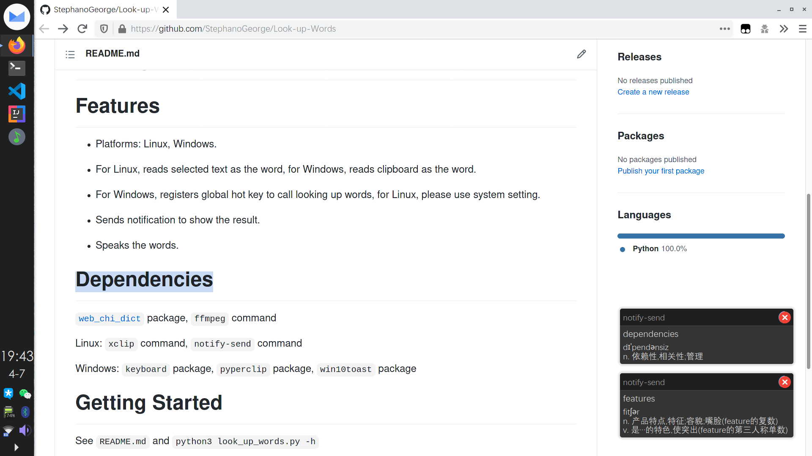

# Look up Words (查词)

# Features

- Platforms: Linux, Windows.
- For Linux, reads selected text as the word, for Windows, reads clipboard as the word.
- For Windows, registers global hot key to call looking up words, for Linux, please use system setting.
- Sends notification to show the result.
- Speaks the words.

# Dependencies

[`web_chi_dict`](https://github.com/StephanoGeorge/Web-Chi-Dict) package, `ffmpeg` command

Linux: `xclip` command, `notify-send` command

Windows: `keyboard` package, `pyperclip` package, `win10toast` package

# Getting Started

See `README.md` and `python3 look_up_words.py -h`

# Details

Use youdao.com API
